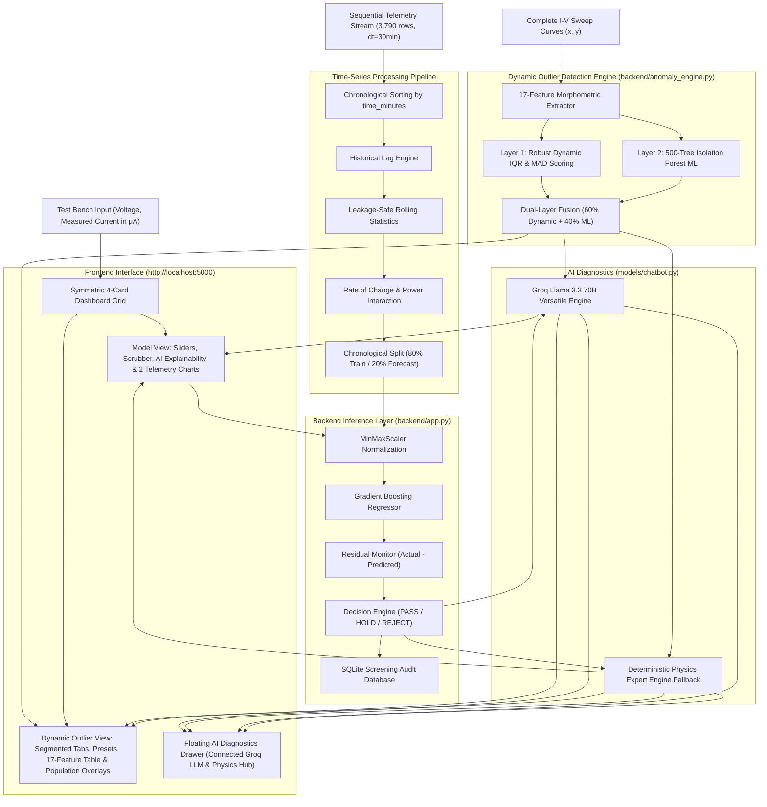

# SIH26170 - AI-Driven Anomaly Detection in Component Burn-In and Screening
### Predictive Environmental Stress Screening & Dynamic Outlier Detection for Semiconductor Components
**Team Drishti • Symbiosis Institute of Technology, Pune • Smart India Hackathon 2024**

---

## Team Members and Student IDs

| Number | Member Name | Student ID | Domain |
| :---: | :--- | :--- | :--- |
| 1 | **Samarth Buchake** | 25070126151 | Machine Learning & Fullstack Architecture |
| 2 | **Vibhuti Patil** | 25070126193 | Physics of Failure & Semiconductor Models |
| 3 | **Maitreyee Kulkarni** | 24070123058 | Data Preprocessing & Statistical Calibration |
| 4 | **Varija Korti** | 24070123165 | Time-Series Regression & Drift Prediction |
| 5 | **Kaushal Sidhpura** | 25070127093 | Dynamic Outlier Detection & Anomaly Scoring |
| 6 | **Prachi Hirve** | 26070126090 | Explainability Engine & Quality Diagnostics |

---

## Problem Context

### Background
In high-reliability sectors such as space missions, satellite avionics, and defense hardware, electronic components (e.g., IGBTs, MOSFETs) undergo rigorous Environmental Stress Screening (ESS), including high-temperature accelerated burn-in testing at $125^\circ\text{C}$ across hundreds of operational hours.

### The Hidden Defect Challenge
Traditional semiconductor test benches rely on **fixed static datasheet ceilings**. When subtle internal material defects drift quietly below standard limits, flawed semiconductors pass basic screening, reach flight assembly, and cause catastrophic in-orbit failures:

```
Batch Typical Current: 10 microAmpere
Flawed Part Current:   45 microAmpere
Fixed Datasheet Limit: 50 microAmpere (Technically passes, but carries extreme latent failure risk)
```

**Drishti** solves this challenge by detecting subtle population-relative drift across full I-V sweep curves and forecasting long-term time-series degradation before parts ever leave the ground.

---

## Solution Architecture

### 1. Dynamic Outlier Detection System (17-Feature Morphometry)
Rather than evaluating single isolated scalar points, the Dynamic Outlier Detection System ingests complete multi-cycle I-V sweep curves ($V_{ce}-I_c$, $V_{app}-I_{leak}$, $V_{ge}-I_c$). It extracts **17 morphometric & electrical features** and performs **dual-layer population-relative anomaly detection**:
- **Layer 1 (Robust Dynamic IQR Scoring)**: Computes robust z-scores relative to lot median and Median Absolute Deviation ($\text{MAD}$) evaluated against dynamic threshold $\theta_{\text{dynamic}}$.
- **Layer 2 (Isolation Forest ML)**: Unsupervised ensemble of 500 isolation trees mapping multi-dimensional feature isolation depth.
- **Dual-Layer Fusion**: Combines normalized dynamic evidence ($60\%$) and isolation evidence ($40\%$) to render definitive verdicts: `PASS`, `HOLD`, or `REJECT`.

### 2. Time-Series Degradation & Drift Predictor
An operational time-series regression pipeline analyzing sequential sensor telemetry across 3,790 observations with 30-minute intervals:
- **Feature Engineering**: Historical lags, leakage-safe rolling window statistics, electrical rate-of-change indicators, and power interaction metrics.
- **Chronological Evaluation**: Past 80% baseline training and future 20% unseen evaluation without lookahead shuffling.
- **Gradient Boosted Regression**: Evaluates drift curves using TimeSeriesSplit cross-validation to project degradation trends.
- **Residual Monitoring**: Tracks residuals ($e = I_{\text{measured}} - I_{\text{forecast}}$) to capture sustained leakage acceleration, dielectric charge trapping, and early breakdown onsets.

### 3. Physics-Grounded AI Explainability & Connected LLM Diagnostics
Powered by **Groq Llama 3.3 70B Versatile** (with deterministic offline semiconductor physics fallback), the system translates mathematical curve discrepancies into plain-language root-cause failure analyses, identifying avalanche breakdown multiplication, deep-level SRH trap recombination, and oxide charge trapping for quality assurance teams.

---

## System Architecture



---

## User Interface Structure

The application features a clean, white-themed layout with Indian flag accents (saffron orange, chakra blue, india green, navy, and purple):

1. **Dashboard (Landing Page)**:
   - Symmetric 4-card grid for easy navigation:
     1. `Dynamic Outlier Detection System` (Purple Theme)
     2. `Time-Series & Breakdown` (Chakra Blue Theme)
     3. `Leakage IV Model` (India Green Theme)
     4. `Turn-On Model` (Chakra Navy Theme)

2. **Model Views (`#view-model`)**:
   - **Left Column**: Synchronized voltage/current sliders, elapsed burn-in time scrubber (0 to 113,700 min) with Auto-Play simulation, condition presets, and screening verdict cards.
   - **Right Column**: AI Failure Physics & Explainability panel with connected LLM badge (`🟢 Groq • Llama 3.3 70B Versatile`), quick prompt suggestion chips, and 2 interactive telemetry graphs.

3. **Dynamic Outlier Detection View (`#view-outlier`)**:
   - Segmented top-bar model switcher (`Breakdown`, `Leakage IV`, `Turn-On`).
   - Sweep curve presets (`Curve 9 (Defective)`, `Curve 8 (Moderate Drift)`, `Curve 2 (Severe Knee Collapse)`, `Curve 0 (Nominal PASS)`, `⚡ Custom Curve Injection`).
   - 4-metric summary grid (`Dual-Layer Verdict`, `Dynamic IQR Score`, `Isolation Forest Depth`, `Combined Anomaly Score`).
   - Population overlay curve chart and 17-feature deviation radar/bar chart.
   - Full 17-feature breakdown table with population median, MAD, robust z-score, and defect flags.

4. **Floating AI Diagnostics Drawer**:
   - Fixed to bottom right with 2-row collision-free header displaying the active model (`🟢 Groq LPU • Llama 3.3 70B`).
   - Interactive **Welcome Dashboard** with 4 quick-start diagnostic cards (*Avalanche Breakdown*, *SRH Recombination*, *Screening Policies*, *17 Features*).
   - Seamless FAB show/hide toggle.

---

## Getting Started

### Prerequisites
- Python 3.9 or higher
- Standard modern web browser (Chrome, Brave, Firefox, Edge, Safari)

### Installation & Launch

1. Navigate to the project directory:
```bash
cd "/Users/samarth/Documents/SIH 26"
```

2. Start the local server:
```bash
python3 backend/app.py --port 5000
```

3. Open your browser and navigate to:
```
http://localhost:5000
```

---

## Directory Structure

```
.
├── archive/                # Archived legacy and raw multi-part datasets
│   ├── Dataset/            # Raw multi-part NASA IGBT/MOSFET measurements
│   └── final_data/         # Legacy final_data folder (dataset + drafts)
├── backend/
│   ├── app.py              # HTTP server and REST API routing
│   ├── pipeline.py         # Master screening pipeline and verdict engine
│   ├── anomaly_engine.py   # Dynamic Outlier Detection Engine (17-feature morphometry & fusion)
│   ├── model_engine.py     # Time-series GBR and degradation forecasting
│   ├── scaler.py           # Feature normalization engine
│   └── data/               # Persistent SQLite screening audit database
├── data/                   # Active chronological time-series & microampere datasets
│   ├── Breakdown_timeseries_microampere.csv
│   ├── LeakageIV_timeseries_microampere.csv
│   ├── TurnOn_timeseries_microampere.csv
│   ├── Breakdown.csv
│   ├── LeakageIV.csv
│   └── TurnOn.csv
├── frontend/
│   ├── index.html          # Split-screen UI, 4-card dashboard, and outlier views
│   ├── styles.css          # Modern CSS styling and responsive layout rules
│   └── app.js              # State management, Chart.js renderers, and API bridge
├── models/                 # Physics models, notebooks, and chatbot fallback
├── api.md                  # Comprehensive REST API reference
├── README.md               # Project overview and architecture
└── walkthrough.md          # Verification notes and technical walkthrough
```