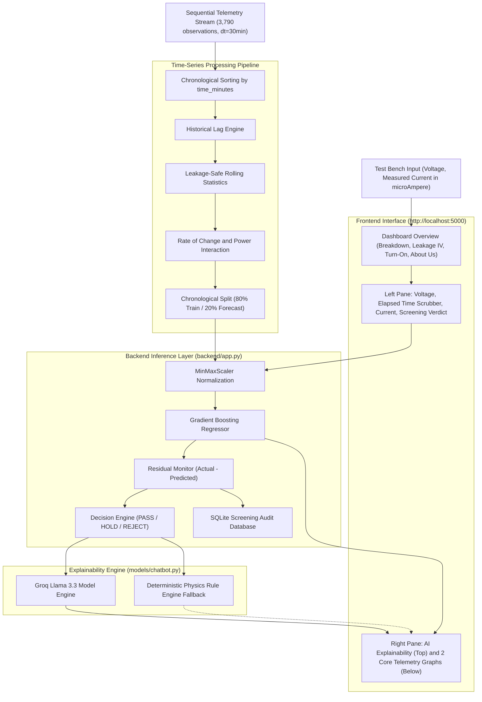

# SIH26170 - AI-Driven Anomaly Detection in Component Burn-In and Screening
### Predictive Environmental Stress Screening for Semiconductor Components
**Team Drishti • Symbiosis Institute of Technology, Pune • Smart India Hackathon 2024**

---

## Team Members and Student IDs

| Number | Member Name | Student ID | Domain |
| :---: | :--- | :--- | :--- |
| 1 | **Samarth Buchake** | 25070126151 | Machine Learning and Fullstack Architecture |
| 2 | **Vibhuti Patil** | 25070126193 | Physics of Failure and Semiconductor Models |
| 3 | **Maitreyee Kulkarni** | 24070123058 | Data Preprocessing and Statistical Calibration |
| 4 | **Varija Korti** | 24070123165 | Time-Series Regression and Drift Prediction |
| 5 | **Kaushal Sidhpura** | 25070127093 | Dynamic Outlier Detection and Anomaly Scoring |
| 6 | **Prachi Hirve** | 26070126090 | Explainability Engine and Quality Diagnostics |

---

## Problem Context

### Background
In high-reliability sectors such as space missions and satellite hardware, electronic components undergo rigorous Environmental Stress Screening, including high-temperature burn-in testing at 125°C across hundreds of operational hours.

### The Hidden Defect Challenge
Traditional semiconductor testing relies on fixed datasheet ceilings. When subtle internal material defects drift quietly below standard limits, flawed semiconductors pass basic screening, reach flight assembly, and cause catastrophic orbital failures:

```
Batch Typical Current: 10 microAmpere
Flawed Part Current:   45 microAmpere
Fixed Datasheet Limit: 50 microAmpere (Technically passes, but carries extreme latent failure risk)
```

Drishti solves this challenge by detecting subtle population-relative drift and forecasting long-term degradation before parts ever leave the ground.

---

## Solution Architecture

### 1. Dynamic Population Outlier Detection
Rather than checking only hard ceiling limits, the engine compares individual component degradation trajectories against the collective batch distribution, flagging devices that drift away from healthy peers.

### 2. Time-Series Degradation and Drift Predictor
An operational time-series regression pipeline analyzing sequential sensor telemetry across 3,790 observations with 30-minute intervals:
- **Feature Engineering**: Lags, rolling window statistics shifted to prevent lookahead bias, electrical delta indicators, and power interaction metrics.
- **Chronological Evaluation**: Past 80% baseline training and future 20% unseen evaluation without shuffling.
- **Gradient Boosted Regression**: Evaluates drift curves using TimeSeriesSplit cross-validation to project degradation trends.
- **Residual Monitoring**: Tracks residuals (Actual minus Predicted current in microAmpere) to capture sustained leakage acceleration, dielectric charge trapping, and early breakdown onsets.

### 3. Physics-Grounded AI Explainability
Powered by Groq Llama 3.3, the system translates mathematical curve discrepancies into plain-language semiconductor physics root-cause analyses, identifying avalanche breakdown, carrier trap recombination, and threshold voltage drift for quality assurance teams.

---

## System Architecture



---

## User Interface Structure

The application features a clean, responsive split-screen layout designed for laboratory screening workflows:

1. **Dashboard View**:
   - High-level overview cards for the three semiconductor models and the team background.
   - Quick navigation to Breakdown, Leakage IV, Turn-On, and About Us.

2. **Model View**:
   - **Left Column**:
     - Input Voltage field and synchronized voltage slider.
     - Elapsed Burn-In Time scrubber (0 to 113,700 minutes) with real-time Auto-Play simulation.
     - Measured Current field and synchronized current slider (in microAmpere).
     - Instant device condition presets (Aged, Pristine, Runaway).
     - Screening Verdict card displaying status (PASS / HOLD / REJECT) alongside GBR forecast, measured current, residual error, and drift percentage.
   - **Right Column**:
     - **AI Failure Physics and Explainability Panel (Top)**: Real-time root-cause failure breakdown and interactive question-and-answer bar.
     - **Graph 1: Leakage Current vs Time**: Displays historical training points, future forecast, live operating marker, with an in-toolbar button to view laboratory scatterplots.
     - **Graph 2: Operating Stress Voltage Profile**: Displays chronological voltage stress trajectory with an in-toolbar button to view transfer curves and tolerance limits.

3. **About Us View**:
   - Team background, challenge summary, technical methodology, and member roster presented in clean human language with zero bracketed text.

---

## Getting Started

### Prerequisites
- Python 3.9 or higher
- Standard web browser (Chrome, Brave, Firefox, Edge, Safari)

### Installation and Launch

1. Navigate to the project directory:
```bash
cd "/Users/samarth/Documents/SIH 26"
```

2. Start the local server:
```bash
python3 backend/app.py --port 5000
```

3. Open your browser and navigate to:
```
http://localhost:5000
```

---

## Directory Structure

```
.
├── archive/                # Archived legacy and raw multi-part datasets
│   ├── Dataset/            # Raw multi-part NASA IGBT/MOSFET measurements
│   └── final_data/         # Legacy final_data folder (dataset + drafts)
├── backend/
│   ├── app.py              # HTTP server and REST API routing
│   ├── pipeline.py         # Master screening pipeline and verdict engine
│   ├── model_engine.py     # Time-series GBR and degradation forecasting
│   ├── scaler.py           # Feature normalization engine
│   └── data/               # Persistent SQLite screening audit database
├── data/                   # Active chronological time-series & microampere datasets
│   ├── Breakdown_timeseries_microampere.csv
│   ├── LeakageIV_timeseries_microampere.csv
│   ├── TurnOn_timeseries_microampere.csv
│   ├── Breakdown.csv
│   ├── LeakageIV.csv
│   └── TurnOn.csv
├── frontend/
│   ├── index.html          # Split-screen UI, dashboard, and About Us view
│   ├── styles.css          # Modern CSS styling and responsive layout rules
│   └── app.js              # State management, Chart.js renderers, and API bridge
├── models/                 # Physics models, notebooks, and chatbot fallback
├── api.md                  # Comprehensive REST API reference
├── README.md               # Project overview and architecture
└── walkthrough.md          # Verification notes and technical walkthrough
```