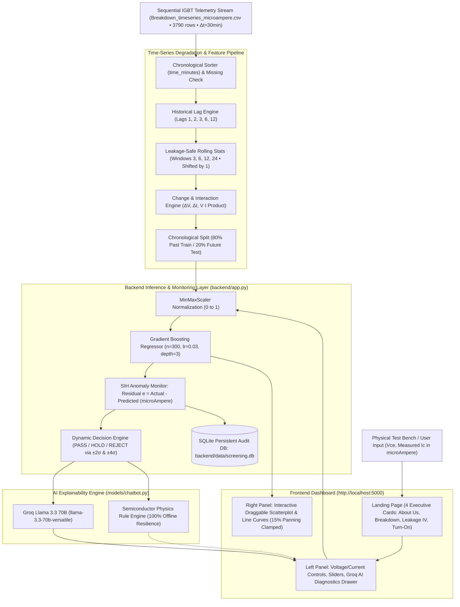

# SIH26170 - AI-Driven Anomaly Detection in Component Burn-In & Screening
### Predictive Environmental Stress Screening for Semiconductor Components
**Team: Drishti - Insightful Vision • Symbiosis Institute of Technology (SIT), Pune • SIH 2026**

---

## Team Drishti — Members & PRNs
| # | Member Name | PRN / Student ID | Role / Domain |
| :-: | :--- | :--- | :--- |
| 1 | **Samarth Buchake** | `25070126151` | Machine Learning & Fullstack Architecture |
| 2 | **Vibhuti Patil** | `25070126193` | Physics of Failure & Semiconductor Models |
| 3 | **Maitreyee Kulkarni** | `24070123058` | Data Preprocessing & Statistical Calibration |
| 4 | **Varija Korti** | `24070123165` | Time-Series Regression & Drift Prediction |
| 5 | **Kaushal Sidhpura** | `25070127093` | Dynamic Outlier Detection & Anomaly Scoring |
| 6 | **Prachi Hirve** | `26070126090` | Explainability Engine & QA Diagnostics |

---

## Problem Statement & Background (SIH26170)

### Background
In high-reliability sectors (such as space and aerospace), electronic components undergo rigorous **Environmental Stress Screening (ESS)**, including **Burn-In testing** (operating components at elevated temperatures, e.g., 125°C for extended periods like 0h, 24h, 96h, and 168h).

### The Latent Defect Problem
Traditional screening relies on static parametric pass/fail limits. However, **latent defects**—components that pass the absolute limits but exhibit subtle, anomalous drift over time—often escape into final payloads, leading to catastrophic mission failures:

```
Lot Mean Leakage Current = 10 μA
Component Leakage Current = 45 μA
Datasheet Maximum Limit = 50 μA (Technically passes, but is a massive latent failure anomaly)
```

---

## Solution Architecture & Modules

### Module A: Dynamic Outlier Detection System
Static limits catch obvious failures. Module A detects population-relative anomalies by comparing individual component trajectories against the lot baseline distribution.

### Module B: IGBT Time-Series Degradation & Breakdown Predictor
A predictive time-series pipeline operating on chronological sensor measurements (`Breakdown_timeseries_microampere(1).csv`, 3,790 observations at 30-minute intervals).
- **Leakage-Safe Feature Engineering**: Lags `[1, 2, 3, 6, 12]`, shifted rolling statistics `[3, 6, 12, 24]`, voltage/current deltas, and $V_{ce} \cdot I_c$ interaction.
- **Chronological Split**: Past 80% training / Future 20% unseen testing (`shuffle=False`).
- **Regression Engine**: `GradientBoostingRegressor(n_estimators=300, learning_rate=0.03, max_depth=3)` evaluated via 5-Fold `TimeSeriesSplit`.
- **SIH Monitoring Logic**: Monitors prediction residuals ($e_t = \text{Actual} - \text{Predicted}$) to detect sustained leakage drift, charge trapping, and early breakdown onsets.

### Evaluation & Quality Metrics:
- **Anomaly Detection Score**: Zero tolerance for False Negatives (missing a defective part is heavily penalized).
- **Drift Prediction Accuracy**: Minimizes Mean Absolute Error (MAE) on hidden ground truth.
- **AI Explainability**: Generates physics-grounded justifications for QA inspectors using **Groq Llama 3.3**.

## Fullstack Architecture & Time-Series Pipeline Flow



---

## Quick Start Guide

### 1. Start the Fullstack Web Application (Recommended)
```bash
python3 backend/app.py --port 5000
```
Open **`http://localhost:5000`** in your browser.

### 2. Run the Terminal CLI Diagnostic Wizard
```bash
python3 models/chatbot.py
```

### 3. Run Interactive Jupyter Notebooks
```bash
# Open any model notebook in models/
models/breakdown.ipynb
models/leakage.ipynb
models/turnOn.ipynb
models/chatbot_demo.ipynb
```

---

## Key Features

1. ** Clean White Theme with Indian Flag Accents**:
 - Modern, high-contrast white layout with Saffron Orange (`#ea580c`), Chakra Blue (`#1e40af`), and India Green (`#15803d`) accents.
 - Minimal, purely functional text with right-aligned footer disclosure.

2. ** Interactive Draggable, Pannable & Zoomable Graphs**:
 - **Click & Drag on Canvas**: Move the test point marker directly on the **Scatterplot** or **Line Chart** to instantly test any $(X, Y)$ operating condition.
 - **Pan & Zoom**: Pan view with mouse drag and zoom in/out with the scroll wheel to inspect sub-breakdown knees and threshold regions.
 - **Live Range Sliders**: Adjust Input Voltage (V) and Measured Current (A) in real-time.

3. ** Feature Auto-Scaling**:
 - Unscaled user inputs (e.g. `550.0 V`) are automatically standardized using calibrated NASA IGBT dataset statistics.

4. ** Concise 3-Point AI Failure Diagnostics**:
 - Powered by **Groq Llama 3.3**, responses are structured in 3 direct bullet points under 100 words:
 1. **Deviation**: Quantitative drift $\% \Delta$ and ratio.
 2. **Physics Cause**: Primary semiconductor degradation mechanism (Avalanche breakdown, Shockley-Read-Hall recombination, oxide charge trapping $\Delta V_{th}$, or solder fatigue).
 3. **Screening Action**: **PASS**, **HOLD**, or **REJECT** verdict with immediate next physical validation step.

5. ** 100% Uptime & Zero-Dependency Design**:
 - Runs out-of-the-box on Python standard library without mandatory pip installs.
 - Features automatic instant fallback to the built-in physics engine if offline or rate-limited.

---

## Directory Structure & Map

```
SIH 26/
├── backend/
│ ├── app.py # REST API & static web server (port 5000)
│ ├── pipeline.py # Master screening orchestrator (Input -> Scale -> Model -> Explain -> DB)
│ ├── scaler.py # Feature & target standardization module
│ ├── model_engine.py # ML Model inference execution in scaled space
│ ├── database.py # SQLite database persistence layer
│ ├── README.md # Backend architecture documentation
│ └── data/
│ └── screening.db # SQLite database storing all screening records
│
├── frontend/
│ ├── index.html # 4-card landing page & split-screen model layout
│ ├── styles.css # Clean white theme with Indian flag accents
│ └── app.js # SPA routing, interactive Chart.js diagrams & API integration
│
├── models/
│ ├── chatbot.py # Core Groq / Gemini AI Chatbot & Discrepancy Engine (CLI)
│ ├── chatbot_helper.py # Jupyter & Python helper module
│ ├── chatbot_demo.ipynb # Interactive demo notebook
│ ├── models.md # Detailed models & semiconductor physics documentation
│ ├── breakdown.ipynb # Vce vs Ic Breakdown Regression Model
│ ├── leakage.ipynb # Applied Voltage vs Leakage Current Model
│ └── turnOn.ipynb # Gate Voltage vs Collector Current Model
│
├── final_data/
│ └── dataset/ # Cleaned NASA IGBT accelerated aging CSV datasets
│ ├── Breakdown.csv
│ ├── LeakageIV.csv
│ └── TurnOn.csv
│
├── .env # API keys (GROQ_API_KEY)
├── .gitignore # Git ignore rules protecting .env and database
├── README.md # Project overview and architecture (This file)
├── walkthrough.md # Step-by-step user and setup walkthrough
└── api.md # Comprehensive REST API reference
```

---

## Further Documentation
- [**Walkthrough Guide**](file:///Users/samarth/Documents/SIH%2026/walkthrough.md) — Comprehensive user and setup guide.
- [**API Reference**](file:///Users/samarth/Documents/SIH%2026/api.md) — REST API endpoints, schemas, and payloads.
- [**Physics & Models Doc**](file:///Users/samarth/Documents/SIH%2026/models/models.md) — Mathematical formulas and semiconductor failure mechanisms.