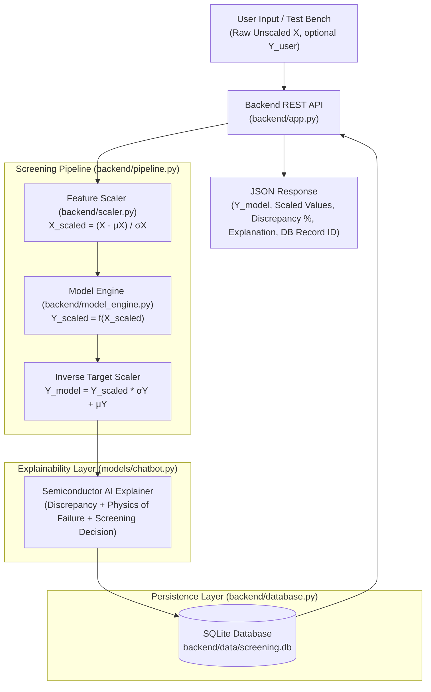

# ⚡ SIH26170 - Backend Pipeline & Model-Chatbot Orchestration

This directory contains the **Backend Service Layer** for **SIH26170: AI-Driven Anomaly Detection in Component Burn-In & Screening**.

It handles the complete flow:
1. **Intakes raw, unscaled user input** ($X_{\text{raw}}$ e.g. voltage, bias conditions) and optional observed ground truth ($Y_{\text{user}}$).
2. **Deals with unscaled input** via standard feature scaling: $X_{\text{scaled}} = \frac{X_{\text{raw}} - \mu_X}{\sigma_X}$.
3. **Executes ML model inference** in scaled space: $Y_{\text{scaled}} = w \cdot X_{\text{scaled}} + b$.
4. **Inverse scales target prediction** back to physical units: $Y_{\text{model}} = Y_{\text{scaled}} \cdot \sigma_Y + \mu_Y$.
5. **Orchestrates explainability chatbot** to evaluate discrepancy ($\Delta, \%\Delta$), map failure physics (avalanche breakdown, SRH recombination, $\Delta V_{th}$ shift), and issue **PASS / HOLD / REJECT** decisions.
6. **Persists transactions into SQLite Database** (`backend/data/screening.db`).
7. **Serves REST API endpoints** for frontend or external services.

---

## 🏗️ Architecture Overview



---

## 📂 File Structure

```
backend/
├── __init__.py           # Package exports
├── scaler.py             # Standard feature & target scaling module
├── model_engine.py       # ML Model inference execution in scaled space
├── database.py           # SQLite database persistence layer (screening.db)
├── pipeline.py           # Master orchestration service (Input -> Scale -> Model -> Explain -> Store)
├── app.py                # REST API HTTP server
├── data/                 # SQLite database storage directory
│   └── screening.db
└── README.md             # Backend documentation
```

---

## ⚙️ Scaling Strategy & Equations

Because the user inputs raw physical values (e.g. $550\text{ V}$ or $5\text{ V}$), the `scaler.py` module applies calibrated statistical parameters fitted from the NASA Accelerated Aging Datasets:

| Model | Feature ($X$) | Mean $\mu_X$ | Std $\sigma_X$ | Target ($Y$) | Mean $\mu_Y$ | Std $\sigma_Y$ |
| :--- | :--- | :--- | :--- | :--- | :--- | :--- |
| **Breakdown** | $V_{ce}$ (V) | $3.883881$ | $0.999395$ | $I_c$ (A) | $7.1072\times 10^{-5}$ | $1.0731\times 10^{-4}$ |
| **Leakage IV** | $V_{\text{app}}$ (V) | $301.3095$ | $173.3395$ | $I_{\text{leak}}$ (A) | $1.8449\times 10^{-6}$ | $1.3856\times 10^{-6}$ |
| **Turn-On** | $V_{ge}$ (V) | $3.883881$ | $0.999395$ | $I_c$ (A) | $7.1072\times 10^{-5}$ | $1.0731\times 10^{-4}$ |

---

## 🚀 How to Run the Backend Server

```bash
python3 backend/app.py --port 5000
```
Server runs at `http://127.0.0.1:5000/`.

---

## 📡 REST API Endpoints

### 1. `POST /api/pipeline/run` (Master Flow)
Takes unscaled raw input and optional user ground truth, runs auto-scaling, model inference, chatbot explanation, and stores in SQLite.

**Request Body**:
```json
{
  "model_type": "breakdown",
  "raw_input": 550.0,
  "user_said_output": 1.25e-5,
  "component_id": "NASA-IGBT-Part-12",
  "use_ai": true
}
```

**Response**:
```json
{
  "record_id": 1,
  "component_id": "NASA-IGBT-Part-12",
  "model_type": "breakdown",
  "raw_input": 550.0,
  "scaled_input": 546.4470,
  "scaled_output": 403.8866,
  "physical_output": 0.04341,
  "user_said_output": 1.25e-5,
  "discrepancy": {
    "delta": -0.04339,
    "pct_diff": -99.97,
    "ratio": 0.00028,
    "direction": "USER_LOWER_THAN_MODEL",
    "risk_decision": "HOLD",
    "severity": "MODERATE"
  },
  "physics_causes": [
    "Model over-estimation at sub-breakdown voltage or superior die quality with lower defect density.",
    "Measurement instrument range / compliance limit saturation."
  ],
  "recommendations": [
    "Verify instrument sensitivity threshold (femto-ammeter vs standard SMU).",
    "Refine regression model calibration in the low-field sub-threshold region."
  ],
  "chatbot_explanation": "### 🔬 Semiconductor Model Discrepancy Diagnostic Report...",
  "ai_provider": "offline"
}
```

---

### 2. `POST /api/predict`
Runs auto-scaled prediction only.

**Request Body**:
```json
{
  "model_type": "leakage",
  "raw_input": 25.0
}
```

---

### 3. `GET /api/history`
Query stored screenings from SQLite DB. Supports query filters: `?limit=20&model_type=breakdown&risk_decision=REJECT`.

---

### 4. `POST /api/chat`
Conversational endpoint linked to models and SQLite database logging.

**Request Body**:
```json
{
  "message": "Why does leakage current increase with temperature in IGBTs?",
  "session_id": "session_123"
}
```

---

## 🐍 Python Library Usage

```python
from backend.pipeline import ScreeningPipeline

pipeline = ScreeningPipeline()

# Run full pipeline with unscaled inputs:
result = pipeline.process_screening(
    model_type="breakdown",
    raw_input=550.0,
    user_said_output=1.25e-5,
    component_id="NASA-Part-12"
)

print("DB Record ID:", result["record_id"])
print("Scaled Input:", result["scaled_input"])
print("Model Prediction:", result["physical_output"])
print("Risk Decision:", result["discrepancy"]["risk_decision"])
print("Explanation:\n", result["chatbot_explanation"])
```
