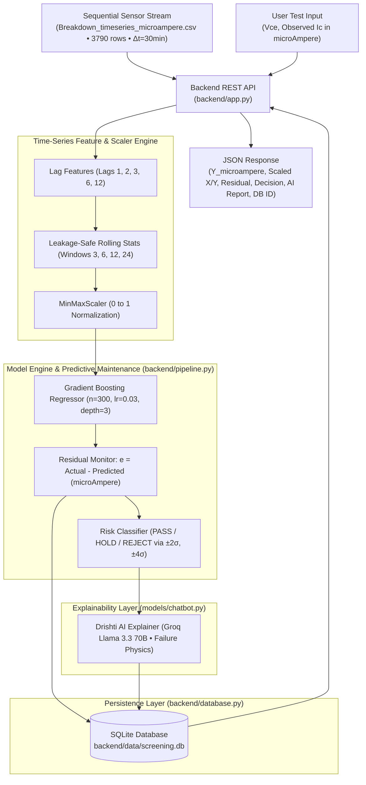

# SIH26170 - Backend Pipeline & Model-Chatbot Orchestration

This directory contains the **Backend Service Layer** for **SIH26170: AI-Driven Anomaly Detection in Component Burn-In & Screening** and the **IGBT Time-Series Degradation & Breakdown Prediction Pipeline**.

It handles the complete flow:
1. **Sequential Data Ingestion**: Ingests chronological telemetry streams (`Breakdown_timeseries_microampere.csv`, 3790 observations, $\Delta t = 30\text{ min}$).
2. **Leakage-Safe Time-Series Feature Engineering**: Lags $[1..12]$, shifted rolling statistics $[3..24]$, $\Delta V_{ce}, \Delta I_c$, and $V_{ce} \cdot I_c$ power interactions.
3. **MinMaxScaler Normalization & Gradient Boosting Regression**: Evaluates time-series degradation models and direct physical regression in $[0, 1]$ scaled and microAmpere space.
4. **Predictive Maintenance & Residual Anomaly Monitoring**: Computes prediction residuals ($e_t = \text{Actual} - \text{Predicted}$) to detect sustained leakage current drift and early breakdown warnings.
5. **AI Failure Physics Explainer**: Uses Groq Llama 3.3 to issue **PASS / HOLD / REJECT** decisions grounded in semiconductor physics.
6. **Persistence Layer**: Saves all transactions, residuals, and AI verdicts into SQLite (`backend/data/screening.db`).

---

## Architecture Overview



---

## File Structure

```
backend/
├── __init__.py            # Package exports (MinMaxScaler, ModelEngine, ScreeningPipeline)
├── scaler.py              # MinMaxScaler module [0, 1] for semiconductor parameters
├── model_engine.py        # ML Model inference execution (Gradient Boosting Time-Series Degradation)
├── database.py            # SQLite database persistence layer (screening.db)
├── pipeline.py            # Master orchestration service (Input -> Scale -> Model -> Explain -> Store)
├── app.py                 # REST API HTTP server (serves frontend SPA + 11 REST endpoints)
├── generate_spec_docx.py  # System specification DOCX sheet generator
├── data/                  # SQLite database storage directory
│   └── screening.db
└── README.md              # Backend documentation
```

---

## Calibration Bounds & MicroAmpere Targets

| Model | Feature ($X$) | Min $X$ | Max $X$ | Target ($Y$) | Min $Y$ | Max $Y$ | Algorithm / Task |
| :--- | :--- | :--- | :--- | :--- | :--- | :--- | :--- |
| **Time-Series Degradation** | Lags $[1..12]$ | $0.0\text{ V}$ | $650.0\text{ V}$ | $I_c$ ($\mu\text{A}$) | $0.0\ \mu\text{A}$ | $150.0\ \mu\text{A}$ | Gradient Boosting ($n=300, lr=0.03$) |
| **Breakdown** | $V_{ce}$ (V) | $0.0\text{ V}$ | $650.0\text{ V}$ | $I_c$ ($\mu\text{A}$) | $0.0\ \mu\text{A}$ | $150.0\ \mu\text{A}$ | Polynomial Avalanche Regression |
| **Leakage IV** | $V_{\text{app}}$ (V) | $0.0\text{ V}$ | $600.0\text{ V}$ | $I_{\text{leak}}$ ($\mu\text{A}$) | $0.0\ \mu\text{A}$ | $10.0\ \mu\text{A}$ | Linear SRH Generation Model |
| **Turn-On** | $V_{ge}$ (V) | $0.0\text{ V}$ | $15.0\text{ V}$ | $I_c$ ($\mu\text{A}$) | $0.0\ \mu\text{A}$ | $250.0\ \mu\text{A}$ | Sub-threshold & Channel Conduction |

---

## How to Run the Backend Server

```bash
python3 backend/app.py --port 5000
```
Server runs at `http://127.0.0.1:5000/`.

---

## REST API Endpoints

### 1. `POST /api/pipeline/run` (Master Flow)
Takes unscaled raw input and optional user ground truth, runs auto-scaling, model inference, chatbot explanation, and stores in SQLite.

**Request Body**:
```json
{
 "model_type": "breakdown",
 "raw_input": 550.0,
 "user_said_output": 1.25e-5,
 "component_id": "NASA-IGBT-Part-12",
 "use_ai": true
}
```

**Response**:
```json
{
 "record_id": 1,
 "component_id": "NASA-IGBT-Part-12",
 "model_type": "breakdown",
 "raw_input": 550.0,
 "scaled_input": 546.4470,
 "scaled_output": 403.8866,
 "physical_output": 0.04341,
 "user_said_output": 1.25e-5,
 "discrepancy": {
 "delta": -0.04339,
 "pct_diff": -99.97,
 "ratio": 0.00028,
 "direction": "USER_LOWER_THAN_MODEL",
 "risk_decision": "HOLD",
 "severity": "MODERATE"
 },
 "physics_causes": [
 "Model over-estimation at sub-breakdown voltage or superior die quality with lower defect density.",
 "Measurement instrument range / compliance limit saturation."
 ],
 "recommendations": [
 "Verify instrument sensitivity threshold (femto-ammeter vs standard SMU).",
 "Refine regression model calibration in the low-field sub-threshold region."
 ],
 "chatbot_explanation": "### Semiconductor Model Discrepancy Diagnostic Report...",
 "ai_provider": "offline"
}
```

---

### 2. `POST /api/predict`
Runs auto-scaled prediction only.

**Request Body**:
```json
{
 "model_type": "leakage",
 "raw_input": 25.0
}
```

---

### 3. `GET /api/history`
Query stored screenings from SQLite DB. Supports query filters: `?limit=20&model_type=breakdown&risk_decision=REJECT`.

---

### 4. `POST /api/chat`
Conversational endpoint linked to models and SQLite database logging.

**Request Body**:
```json
{
 "message": "Why does leakage current increase with temperature in IGBTs?",
 "session_id": "session_123"
}
```

---

## Python Library Usage

```python
from backend.pipeline import ScreeningPipeline

pipeline = ScreeningPipeline()

# Run full pipeline with unscaled inputs:
result = pipeline.process_screening(
 model_type="breakdown",
 raw_input=550.0,
 user_said_output=1.25e-5,
 component_id="NASA-Part-12"
)

print("DB Record ID:", result["record_id"])
print("Scaled Input:", result["scaled_input"])
print("Model Prediction:", result["physical_output"])
print("Risk Decision:", result["discrepancy"]["risk_decision"])
print("Explanation:\n", result["chatbot_explanation"])
```
