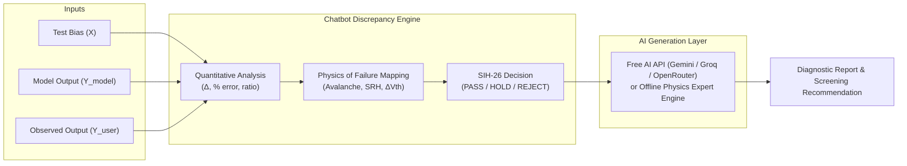

# SIH26170 - Semiconductor Models & AI Explainability System

Welcome to the **Models Section** of **SIH26170: AI-Driven Anomaly Detection in Component Burn-In & Screening** (Predictive Environmental Stress Screening for Semiconductor Components like IGBT IRG4BC30K and MOSFET IRF520Npbf).

This directory contains the machine learning regression models, physical characterization pipelines, and the **API-Based Free Chatbot & Discrepancy Explainability Engine**.

---

## Table of Contents
1. [Overview of Machine Learning Models](#1-overview-of-machine-learning-models)
 - [Breakdown Model (`breakdown.ipynb`)](#breakdown-model)
 - [Leakage IV Model (`leakage.ipynb`)](#leakage-iv-model)
 - [Turn-On Model (`turnOn.ipynb`)](#turn-on-model)

2. [Semiconductor Physics & Degradation Dynamics](#2-semiconductor-physics--degradation-dynamics)
3. [API-Based Free Chatbot & Discrepancy Analyzer](#3-api-based-free-chatbot--discrepancy-analyzer)
 - [Purpose & Core Task](#purpose--core-task)
 - [Supported Free API Providers](#supported-free-api-providers)
 - [Discrepancy Formulation & Metrics](#discrepancy-formulation--metrics)
 - [Automated SIH-26 Risk Assessment](#automated-sih-26-risk-assessment)
4. [How to Run & Use the Chatbot](#4-how-to-run--use-the-chatbot)
 - [1. Interactive CLI Mode](#1-interactive-cli-mode)
 - [2. Modern Web Dashboard UI](#2-modern-web-dashboard-ui)
 - [3. Jupyter Notebook Integration](#3-jupyter-notebook-integration)
 - [4. Demo Notebook](#4-demo-notebook)
5. [File Structure](#5-file-structure)

---

## 1. Overview of Machine Learning Models

The regression models are trained on electrical characterization and accelerated thermal aging datasets from NASA Prognostics Center of Excellence for discrete IGBTs (IRG4BC30K) and MOSFETs (IRF520Npbf).

| Model | Notebook | Dataset | Input Feature ($X$) | Target Output ($Y$) | Nominal Range |
| :--- | :--- | :--- | :--- | :--- | :--- |
| **Time-Series Degradation** | [`ts_fixed_timeseries.ipynb`](file:///Users/samarth/Documents/SIH%2026/models/ts_fixed_timeseries.ipynb) | `Breakdown_timeseries_microampere(1).csv` | Lags $[1..12]$, Rolling Mean/Std $[3..24]$ | Future Leakage Current ($I_c$) [$\mu\text{A}$] | $0 - 650\text{ V} \rightarrow 0 - 250\ \mu\text{A}$ |
| **Breakdown** | [`breakdown.ipynb`](file:///Users/samarth/Documents/SIH%2026/models/breakdown.ipynb) | `Breakdown.csv` | Collector-Emitter Voltage ($V_{ce}$) [V] | Leakage Current ($I_c$) [A] | $0 - 650\text{ V} \rightarrow 1\text{ nA} - 100\ \mu\text{A}$ |
| **Leakage IV** | [`leakage.ipynb`](file:///Users/samarth/Documents/SIH%2026/models/leakage.ipynb) | `LeakageIV.csv` | Applied Bias Voltage ($V$) [V] | Leakage Current ($I_{\text{leak}}$) [A] | $0 - 50\text{ V} \rightarrow 1\text{ nA} - 50\ \mu\text{A}$ |
| **Turn-On** | [`turnOn.ipynb`](file:///Users/samarth/Documents/SIH%2026/models/turnOn.ipynb) | `TurnOn.csv` | Gate-Emitter Voltage ($V_{ge}$) [V] | Collector Current ($I_c$) [A] | $0 - 15\text{ V} \rightarrow 0 - 30\text{ A}$ |

---

### Time-Series Degradation & Breakdown Prediction Model
- **Goal**: Predicts future IGBT leakage current from chronological electrical measurements using Gradient Boosting regression (`GradientBoostingRegressor(n_estimators=300, learning_rate=0.03, max_depth=3)`).
- **Physical Significance & Predictive Maintenance**: Monitored via prediction residuals ($e_t = y_{\text{actual}, t} - \hat{y}_{\text{pred}, t}$) to flag early degradation warnings, persistent residual drift, and avalanche breakdown onsets before catastrophic failure.
- **Leakage Prevention**: Rolling statistics are shifted by 1 observation before window calculation; split is strictly chronological (80% past train / 20% future test).

---

### Breakdown Model
- **Goal**: Predicts collector-emitter leakage current across reverse bias voltages up to avalanche breakdown.
- **Physical Significance**: Identifies avalanche breakdown knee voltage ($V_{BR} \approx 600\text{ V}$ nominal). Under thermal/electrical stress, premature avalanche breakdown indicates guard ring oxide damage or edge termination defects.

### Leakage IV Model
- **Goal**: Predicts reverse leakage current as a function of applied voltage.
- **Physical Significance**: Governed by Shockley-Read-Hall (SRH) generation-recombination in the space-charge region. An increase in pre-breakdown leakage indicates latent crystal defects, dielectric thinning, or solder fatigue.

### Turn-On Model
- **Goal**: Models transfer characteristics ($I_c$ vs $V_{ge}$) and transconductance ($g_m$).
- **Physical Significance**: Captures gate threshold voltage ($V_{th} \approx 4.0\text{ V}$). Hot-carrier stress causes electron trapping in gate $\text{SiO}_2$, leading to positive threshold voltage shift ($\Delta V_{th} > 0$), reduced transconductance, and increased switching conduction losses.

---

## 2. Semiconductor Physics & Degradation Dynamics

The models and explainability engine embody core semiconductor physics governing component aging:

$$\text{Leakage Current: } I_{\text{leak}} \propto T^2 \exp\left(-\frac{E_g}{2 k T}\right) + I_{\text{tunneling}}$$

$$\text{Avalanche Multiplication: } M = \frac{1}{1 - \left(\frac{V_{ce}}{V_{BR}}\right)^n}$$

$$\text{Threshold Voltage Shift: } \Delta V_{th} = -\frac{\Delta Q_{ot} + \Delta Q_{it}}{C_{ox}}$$

1. **Shockley-Read-Hall (SRH) Generation**: Deep-level traps created by thermal cycling accelerate thermal electron-hole generation, elevating sub-threshold leakage.
2. **Impact Ionization & Avalanche Breakdown**: High electric fields accelerate free carriers, initiating avalanche multiplication. Localized defects cause premature micro-plasma breakdown below rated $V_{BR}$.
3. **Gate Dielectric Degradation**: Interface trap generation ($D_{it}$) and oxide trapped charge ($Q_{ot}$) cause $\Delta V_{th}$ drift and transconductance collapse.
4. **Thermal Resistance Degradation ($R_{th,jc}$)**: Solder voiding and bond-wire lift-off increase thermal resistance, creating localized hot spots and accelerating thermal runaway.

---

## 3. API-Based Free Chatbot & Discrepancy Analyzer

### Purpose & Core Task
The chatbot's primary purpose is to **explain model dynamics** and **diagnose discrepancies between ML Model Output ($Y_{\text{model}}$) and User-Specified / Observed Output ($Y_{\text{user}}$)**.

When screening physical semiconductor devices during Environmental Stress Screening (ESS):
- The ML model predicts the baseline healthy behavior: $Y_{\text{model}} = f(X)$.
- Test bench sensors measure the physical component: $Y_{\text{user}}$.
- The Chatbot analyzes the mathematical difference and translates it into **Physics of Failure** causes and **SIH-26 Screening Decisions**.



---

### Supported Free API Providers

The chatbot uses pure Python standard library (`urllib.request`) with **zero mandatory external dependencies**, and supports:

1. **Google Gemini Free Tier** (Default: `gemini-2.0-flash`, `gemini-1.5-flash` via `GEMINI_API_KEY`)
2. **Groq Free Tier** (`llama-3.3-70b-versatile` via `GROQ_API_KEY`)
3. **OpenRouter Free Models** (`google/gemini-2.0-flash-exp:free` via `OPENROUTER_API_KEY`)
4. **Hugging Face Inference API** (via `HF_TOKEN`)
5. **Local Ollama** (`http://localhost:11434`)
6. **Built-in Offline Physics & SIH-26 Expert Engine** (100% Free, zero setup, instant diagnostics without any API key or internet)

---

### Discrepancy Formulation & Metrics

For any test condition $X$:

1. **Absolute Delta**: $\Delta = Y_{\text{user}} - Y_{\text{model}}$
2. **Relative Percentage Deviation**: $\%\Delta = \frac{Y_{\text{user}} - Y_{\text{model}}}{Y_{\text{model}}} \times 100\%$
3. **Magnitude Ratio**: $\text{Ratio} = \frac{Y_{\text{user}}}{Y_{\text{model}}}$
4. **Trajectory Direction**:
 - `USER_HIGHER_THAN_MODEL` ($\Delta > 0$): Indicates accelerated leakage, premature breakdown, or parasitic conduction.
 - `USER_LOWER_THAN_MODEL` ($\Delta < 0$): Indicates positive threshold shift ($\Delta V_{th} > 0$), transconductance collapse, or series contact resistance.
 - `NOMINAL_ALIGNMENT` ($|\%\Delta| \le 10\%$): Normal statistical manufacturing tolerance.

---

### Automated SIH-26 Risk Assessment

| Decision | Badge | Condition | Screening Action |
| :--- | :---: | :--- | :--- |
| **PASS** | | $|\%\Delta| \le 10\%$ or low-risk variance | Component approved for operational flight assembly. |
| **HOLD** | | $10\% < |\%\Delta| \le 50\%$ or pre-breakdown drift | Component quarantined; route to secondary burn-in test & $125^\circ\text{C}$ curve trace. |
| **REJECT** | | $|\%\Delta| > 50\%$, $Y_{\text{user}} > \text{Limit}$, or premature breakdown | Component rejected; latent failure risk detected; route to Destructive Physical Analysis (DPA). |

---

## 4. How to Run & Use the Chatbot

### 1. Interactive CLI Mode
Run the standalone terminal interface:
```bash
python3 models/chatbot.py
```
**Available Commands inside CLI**:
- `explain`: Step-by-step interactive wizard to enter $X$, $Y_{\text{model}}$, and $Y_{\text{user}}$.
- `preset`: Run pre-configured NASA IGBT aging test cases.
- `api`: Switch API provider (Gemini, Groq, OpenRouter, Offline) and set API keys.
- `models`: Print summary of all 3 semiconductor models.
- Or simply type any question to chat with the AI!

---

### 2. Modern Web Dashboard UI
Launch the browser-based interactive dashboard with zero dependencies:
```bash
python3 models/web_app.py --port 8080
```
Open your browser at **`http://localhost:8080`**.

**Features**:
- Interactive Discrepancy & Physics Analyzer with real-time sliders and inputs.
- Quick Presets from NASA IGBT accelerated aging data.
- Live Metric Cards (Absolute Delta, % Deviation, Magnitude Ratio).
- SIH-26 Status Badges ( PASS / HOLD / REJECT).
- Multi-turn AI Chat Assistant.
- API Key manager modal.

---

### 3. Jupyter Notebook Integration
Import helper functions directly in [`breakdown.ipynb`](file:///Users/samarth/Documents/SIH%2026/models/breakdown.ipynb), [`leakage.ipynb`](file:///Users/samarth/Documents/SIH%2026/models/leakage.ipynb), or [`turnOn.ipynb`](file:///Users/samarth/Documents/SIH%2026/models/turnOn.ipynb):

```python
from models.chatbot_helper import explain_discrepancy, chat, set_api_key

# Optional: Set free API key (or leave unset for offline physics engine)
# set_api_key("gemini", "YOUR_API_KEY")

# 1. Diagnose model prediction vs user measurement:
diag = explain_discrepancy(
 model_type="breakdown",
 x_input=550.0,
 y_model=3.87e-6,
 y_user=1.25e-5,
 component_id="NASA-IGBT-Part-12"
)

# 2. Conversational query:
chat("Explain the difference between static limits and dynamic population screening.")
```

---

### 4. Demo Notebook
Open and run the ready-to-use demo notebook:
[`models/chatbot_demo.ipynb`](file:///Users/samarth/Documents/SIH%2026/models/chatbot_demo.ipynb)

---

## 5. File Structure

```
models/
├── chatbot.py # Core chatbot, API connectors, & Discrepancy Diagnostic Engine (CLI)
├── web_app.py # Zero-dependency Web Application server (http://localhost:8080)
├── chatbot_helper.py # Python & Jupyter Notebook integration helper
├── chatbot_demo.ipynb # Interactive demo notebook with test cases
├── models.md # Technical documentation & usage guide
├── breakdown.ipynb # Vce vs Ic Breakdown Regression Model
├── leakage.ipynb # Applied Voltage vs Leakage Current Model
└── turnOn.ipynb # Gate Voltage vs Collector Current Turn-On Model
```

---

*Designed and developed for SIH 2026 — Team SIH26170, SIT Pune.*
